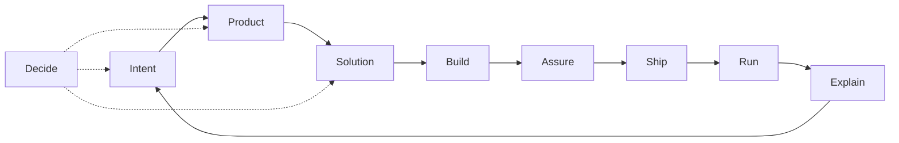

# Skills

Personal skill store for a **product + engineering AI skill OS**: domain routers plus thin language adapters. Lives at `agents/skills/` in this repo. Vocabulary: [`CONTEXT.md`](CONTEXT.md).

| Who                             | How to install                                                                |
| ------------------------------- | ----------------------------------------------------------------------------- |
| Any machine (Cursor, Codex, …)  | [`npx skills`](https://github.com/vercel-labs/skills) — [Install](#install)   |
| This machine (dotfiles + `rcm`) | `rcup` → `~/.agents/skills/<name>/` — [Operate the store](#operate-the-store) |
| Optional third-party packs      | Separate `npx skills add` — [Optional packs](#optional-packs-not-os-sot)      |

## Install

Use when you want these skills without cloning this repo or running `rcup`. Requires Node.js (`npx`) and network access to GitHub (`gildesmarais/dotfiles`).

Skills live under `agents/skills/` on the default branch. Point the CLI at that path (or the repo root — both discover the same published set).

### Browse

```sh
npx skills add gildesmarais/dotfiles/agents/skills --list
```

### Install

```sh
# User-level (all agents you pass), non-interactive
npx skills add gildesmarais/dotfiles/agents/skills -g -a cursor -a codex -y

# Project-level (omit -g; run from the target repo)
npx skills add gildesmarais/dotfiles/agents/skills -a cursor -y

# Specific skills
npx skills add gildesmarais/dotfiles/agents/skills \
  --skill review \
  --skill docs \
  --skill pull-request \
  -g -a cursor -a codex -y
```

Equivalent sources: `gildesmarais/dotfiles`, `https://github.com/gildesmarais/dotfiles`, or `https://github.com/gildesmarais/dotfiles/tree/master/agents/skills`.

### Expected result

- `--list` prints each skill name and description from the default branch.
- Install places skills into the agent directories for the agents you selected (`-a`). With `-g`, that is user-level; without `-g`, project-level under the current repo.
- Verify: `npx skills list -g` (user-level) or `npx skills list` (project-level).

### What to install

| Intent                  | Command shape                                                                 |
| ----------------------- | ----------------------------------------------------------------------------- |
| Full published OS       | `npx skills add gildesmarais/dotfiles/agents/skills -g -a cursor -a codex -y` |
| Assure + Ship           | `--skill review --skill pull-request` (add `release` for notes)               |
| Build (Ruby / Rails)    | `--skill ruby-dev` and/or `--skill ruby-on-rails-dev`                         |
| Build (Rust)            | `--skill rust-dev`                                                            |
| Build (Swift / SwiftUI) | `--skill swift-dev` and/or `--skill swiftui-dev`                              |

Compose rules still apply after install — see [Compose / handoffs](#compose--handoffs). Index: [Skill index](#skill-index).

### Next

- Domain map and when to load each skill: [Domain map](#domain-map)
- Optional Decide / Swift packs (not this store): [Optional packs](#optional-packs-not-os-sot)
- CLI reference: [vercel-labs/skills](https://github.com/vercel-labs/skills)

## Pipeline



## Domain map

| Domain       | Job                              | Skill(s)                                                                         | Primary branches                                                             |
| ------------ | -------------------------------- | -------------------------------------------------------------------------------- | ---------------------------------------------------------------------------- |
| **Intent**   | Fuzzy need → actionable work     | `prompt-synthesis`; `jira-ticket`                                                | `code` \| `architecture` \| `product` (default: Shared prep)                 |
| **Product**  | What to build; admit/defer scope | `product-owner`                                                                  | `gate` (default); stubs: prioritize, story-slice, experiment                 |
| **Solution** | How the system should work       | `architecture`; `docs` **`architecture`** (verify-only)                          | `deep-modules` \| `refactor-types` \| `refactor-boundaries` \| `performance` |
| **Build**    | Change the codebase              | `ruby-dev`, `rust-dev`, `swift-dev`; overlays `ruby-on-rails-dev`, `swiftui-dev` | classify: surgical \| design \| review-hand-off                              |
| **Assure**   | Safe to merge?                   | `review`                                                                         | finish, quality, tests, perf, security, publish                              |
| **Ship**     | Land on mainline                 | `pull-request`; `release`                                                        | PR: open, slice, comment, reply, resolve; release: `notes`                   |
| **Explain**  | Humans understand state          | `communication`; `docs`                                                          | see skill branches                                                           |
| **Decide**   | Stress-test choices              | `grilling` (third-party); `product-owner` Forced Challenge                       | —                                                                            |

Published Build overlays: `ruby-on-rails-dev`, `swiftui-dev`. Local MIR overlay: `mir-architect` — [below](#local-overlay-mir-architect).

## Optional packs (not OS SoT)

Decide helpers and upstream language packs sit outside the domain routers. They are not OS source of truth. Install them with a separate `npx skills add` (not via `rcup` store trees):

```sh
# Decide
npx skills add https://github.com/mattpocock/skills --skill grilling -a cursor -a codex -y

# Swift / Apple (pick what you need)
npx skills add https://github.com/twostraws/swiftui-agent-skill --skill swiftui-pro -a cursor -a codex -y
npx skills add https://github.com/twostraws/swift-testing-agent-skill --skill swift-testing-pro -a cursor -a codex -y
# Catalog: https://github.com/twostraws/Swift-Agent-Skills
```

Store-local spice (`ms-rust`, `rust-performance`) installs the same way as other store skills when those trees are on the default branch (`npx skills` downstream, or `rcup` on this machine).

| Pack                | When you want it                                   | Role                                                                           |
| ------------------- | -------------------------------------------------- | ------------------------------------------------------------------------------ |
| `grilling`          | Stress-test a plan or decision                     | Upstream Decide skill                                                          |
| `ms-rust`           | Microsoft-style Rust guidelines before `.rs` edits | Compose with `rust-dev`                                                        |
| `rust-performance`  | Measure-before-optimize Rust work                  | Craft ownership stays `architecture` **`performance`**                         |
| `swiftui-pro`       | SwiftUI review depth                               | Compose with `swiftui-dev` (and `swift-dev`); depth pack, not Build entrypoint |
| `swift-testing-pro` | Swift Testing depth                                | Compose with `swift-dev`; depth pack, not Build entrypoint                     |
| `swift-*` (other)   | Design / Apple packs                               | Same compose-with rule; may also live under a repo’s `.agents/skills/`         |

Discover more on [skills.sh](https://skills.sh/).

## Compose / handoffs

One-way rules (prevent domain collisions):

1. **Product before non-trivial scope** — `jira-ticket` / feature asks load `product-owner` **`gate`**. Impl continues only on **Build Now**. Skip for pure bugfix, refactor, infra. Product is gate-only this pass (stubs unauthored).
2. **Craft ≠ product** — `architecture` / `*-dev` / `review` never answer “should we build X?”
3. **Build → Solution** — `*-dev` class `design` loads `architecture` (branch pick inside); do not inline craft in `*-dev`.
4. **Phase CC → merge → notes** — Solution/Build plan phases author Conventional Commits (validate → ≥1 CC + rationale). After merge, `release` **`notes`** consumes history. At PR open, `pull-request` **`open`** applies the same format only if the tree is still dirty. Format SoT: [`CONTEXT.md`](CONTEXT.md).
5. **Assure → Ship** — `review` may hand off to `pull-request` **`comment`**. Never reverse: GitHub posting does not live under `review`.
6. **Explain → docs** — `communication` → `docs` **`editor`** when the artifact is a README/runbook, not a message. Never reverse. `docs` **`architecture`** is Solution-adjacent verify-only (no HLD/ADR author).
7. **Overlay → runtime** — Published: `ruby-on-rails-dev` with `ruby-dev`; `swiftui-dev` with `swift-dev`. Local: `mir-architect` with `rust-dev` ([below](#local-overlay-mir-architect)).
8. **Decide** — `grilling` stress-tests Intent / Product / Solution; product doctrine stays with `product-owner` when the topic is scope.

## Skill index

| Domain   | Skills                                                                                                                                                |
| -------- | ----------------------------------------------------------------------------------------------------------------------------------------------------- |
| Intent   | [`prompt-synthesis`](prompt-synthesis/), [`jira-ticket`](jira-ticket/)                                                                                |
| Product  | [`product-owner`](product-owner/)                                                                                                                     |
| Solution | [`architecture`](architecture/), [`docs`](docs/)                                                                                                      |
| Build    | [`ruby-dev`](ruby-dev/), [`rust-dev`](rust-dev/), [`swift-dev`](swift-dev/), [`ruby-on-rails-dev`](ruby-on-rails-dev/), [`swiftui-dev`](swiftui-dev/) |
| Assure   | [`review`](review/)                                                                                                                                   |
| Ship     | [`pull-request`](pull-request/), [`release`](release/)                                                                                                |
| Explain  | [`communication`](communication/), [`docs`](docs/)                                                                                                    |
| Decide   | `grilling` (third-party — [Optional packs](#optional-packs-not-os-sot))                                                                               |

### Local overlay: `mir-architect`

MIR / rhythmic-analysis overlay for `rust-dev` (club music grids, downbeat, tempo).

|           |                                                           |
| --------- | --------------------------------------------------------- |
| **When**  | `agents/skills/mir-architect/` is present on this machine |
| **How**   | `rcup` (same as other store skills)                       |
| **Scope** | Local MIR stack only                                      |

## Authoring laws

- **One router per domain** — branches for verb-paths; progressive load.
- **Freeze the router** — harvest via staging → sparse-promote onto `reference/<branch>.md`; edit `SKILL.md` only when the contract is wrong.
- **Compose across domains** with one-way handoffs (above).
- **Thin `*-dev`** — craft stays in `architecture`; overlays are deltas only.
- **Phase commits on Build** — every new `{lang}-dev` includes the Contracts Phase commits bullet (same wording as `rust-dev`); overlays never copy it. Solution/Build plans encode validate→commit per phase via [`CONTEXT.md`](CONTEXT.md).
- **Local overlays** — may live under `agents/skills/` (e.g. `mir-architect`); document when/how/scope; they install via `rcup`.
- **Proliferation guard** — new top-level skill only if it cannot be a branch of an existing router (for refactor concerns: `refactor-<concern>` under `architecture`, never bare `refactor` or a parallel `product` skill).

Router shape: `## Pick branch` → `## Shared prep` → `## Branch reference` → `## Handoff` → `## Completion criteria`. Relative `reference/*.md` links; unnumbered `##` headers. Terms: [`CONTEXT.md`](CONTEXT.md). Spec: [agentskills.io](https://agentskills.io/).

---

## Operate the store

For the dotfiles owner on a machine that uses `rcm`. Everyone else: [Install](#install).

Model: git-tracked trees under `agents/skills/<name>/` are the source of truth. `rcup` installs them into `~/.agents/skills/<name>/` (file-level links). Keep `SYMLINK_DIRS` unset for `agents` / `agents/skills` so `~/.agents/skills` can hold both `rcup` links and third-party dirs from `npx skills`. After clone/pull or promote/rename, run `rcup` (or wait for topgrade `RCM: rcup`).

| Command                    | Role                                                  |
| -------------------------- | ----------------------------------------------------- |
| `skill list`               | List non-hidden skills in the store                   |
| `skill promote <name>`     | Move `<project>/.agents/skills/<name>` into the store |
| `skill rename <old> <new>` | Rename in the store                                   |
| `rcup`                     | Install store skills into `~/.agents/skills`          |

### Paths

| Scope         | Path                                             |
| ------------- | ------------------------------------------------ |
| Store         | `agents/skills/<name>/` in this repo             |
| Agent install | `~/.agents/skills/<name>/` via `rcup`            |
| Project draft | `<repo>/.agents/skills/<name>/` (promote source) |
