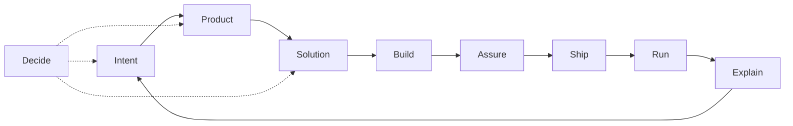

# Skills

Personal skill store for a product + engineering AI skill OS: domain routers (Build entry: `dev`), Solution craft (`architecture`), and thin language adapters/overlays under `agents/skills/`. Vocabulary: [`CONTEXT.md`](CONTEXT.md).

## Install

Global (user-level Cursor + Codex):

```sh
npx skills add gildesmarais/dotfiles/agents/skills -g -a cursor -a codex -y
```

Requires Node.js (`npx`) and GitHub access to `gildesmarais/dotfiles`. Verify with `npx skills list -g`.

| Intent               | Command                                                                       |
| -------------------- | ----------------------------------------------------------------------------- |
| Browse               | `npx skills add gildesmarais/dotfiles/agents/skills --list`                   |
| Project-level        | Same add, omit `-g`; run from the target repo                                 |
| Specific skills      | Add `--skill <name>` (repeatable), e.g. `--skill review.gil --skill docs`     |
| This machine (`rcm`) | `rcup` → `~/.agents/skills/<name>/` — [Operate the store](#operate-the-store) |

Equivalent sources: `gildesmarais/dotfiles`, the GitHub URL, or `…/tree/master/agents/skills`. CLI: [vercel-labs/skills](https://github.com/vercel-labs/skills).

## Pipeline



## Domain map

| Domain       | Job                              | Skill(s)                                                                                                                    | Primary branches                                                                                                                        |
| ------------ | -------------------------------- | --------------------------------------------------------------------------------------------------------------------------- | --------------------------------------------------------------------------------------------------------------------------------------- |
| **Intent**   | Fuzzy need → actionable work     | `prompt-synthesis`; `jira-ticket`                                                                                           | `code` \| `architecture` \| `product` (default: Shared prep)                                                                            |
| **Product**  | What to build; admit/defer scope | `product-owner`                                                                                                             | `gate` (default); stubs: prioritize, story-slice, experiment                                                                            |
| **Solution** | How the system should work       | `architecture`; `docs` **`architecture`** (verify-only); `dev` **`plan`** (implementation-plan carrier)                     | craft: `deep-modules` \| `refactor-types` \| `refactor-boundaries` \| `performance`; survey: `structure-survey`; plan: `dev` **`plan`** |
| **Build**    | Change the codebase              | `dev` (router); adapters `ruby-dev`, `rust-dev`, `swift-dev`, `typescript-dev`; overlays `ruby-on-rails-dev`, `swiftui-dev` | `plan` \| `implement`; classify: surgical \| design \| review-hand-off                                                                  |
| **Assure**   | Safe to merge?                   | `review.gil`                                                                                                                | finish, quality, tests, perf, security, legacy, publish                                                                                 |
| **Ship**     | Land on mainline                 | `pull-request`; `release`                                                                                                   | PR: open, slice, comment, reply, resolve; release: `notes`                                                                              |
| **Explain**  | Humans understand state          | `communication`; `docs`                                                                                                     | see skill branches                                                                                                                      |
| **Decide**   | Stress-test choices              | `grilling` (third-party); `product-owner` Forced Challenge                                                                  | —                                                                                                                                       |

Published Build overlays: `ruby-on-rails-dev`, `swiftui-dev`. Rust depth (store): `ms-rust`, `rust-performance`.

## Optional packs (not OS SoT)

Third-party helpers outside the domain routers. Not OS source of truth; not in the store install above.

```sh
npx skills add https://github.com/mattpocock/skills --skill grilling -g -a cursor -a codex -y && \
npx skills add https://github.com/twostraws/swiftui-agent-skill --skill swiftui-pro -g -a cursor -a codex -y && \
npx skills add https://github.com/twostraws/swift-testing-agent-skill --skill swift-testing-pro -g -a cursor -a codex -y && \
npx skills add https://github.com/arjitj2/swiftui-design-principles --skill swiftui-design-principles -g -a cursor -a codex -y
```

| Pack                        | When                           | Role                                                            |
| --------------------------- | ------------------------------ | --------------------------------------------------------------- |
| `grilling`                  | Stress-test a plan or decision | Upstream Decide skill                                           |
| `swiftui-pro`               | SwiftUI review depth           | Compose via `$dev` + `swiftui-dev`; depth pack, not Build entry |
| `swift-testing-pro`         | Swift Testing depth            | Compose via `$dev` + `swift-dev`; depth pack, not Build entry   |
| `swiftui-design-principles` | Spacing, typography, materials | Compose via `$dev` + `swiftui-dev`; depth pack, not Build entry |

More: [skills.sh](https://skills.sh/). Swift catalog: [Swift-Agent-Skills](https://github.com/twostraws/Swift-Agent-Skills).

## Compose / handoffs

One-way rules (prevent domain collisions):

1. **Product before non-trivial scope** — `jira-ticket` / feature asks load `product-owner` **`gate`**. Impl continues only on **Build Now** → `$dev`. Skip for pure bug fix, refactor, infra. Product is gate-only this pass (stubs unauthored).
2. **Craft ≠ product** — `architecture` / `dev` / `*-dev` / `review.gil` never answer “should we build X?”
3. **Build entry is `$dev`** — classify / route / phase commits live there. Class `design` → `architecture` (branch pick inside); do not inline craft in `dev` or `*-dev`. Multi-load `{lang}-dev` from **touched-file** evidence when a change spans runtimes.
4. **Implementation plans → `$dev` `plan`** — when writing an implementation plan (including Cursor plan mode), invoke `$dev` branch **`plan`** so classify, runtime route, and validate→commit phases are in the plan.
5. **Phase CC → merge → notes** — Solution/Build plan phases author Conventional Commits (validate → ≥1 CC + rationale) via `architecture` Shared prep and `$dev`. After merge, `release` **`notes`** consumes history. At PR open, `pull-request` **`open`** applies the same format only if the tree is still dirty. Format SoT: [`CONTEXT.md`](CONTEXT.md).
6. **Assure → Ship** — `review.gil` may hand off to `pull-request` **`comment`**. Never reverse: GitHub posting does not live under `review.gil`.
7. **Explain → docs** — `communication` → `docs` **`editor`** when the artifact is a README/runbook, not a message. Never reverse. `docs` **`architecture`** is Solution-adjacent verify-only (no HLD/ADR author).
8. **Overlay via `$dev` route** — `ruby-on-rails-dev` with `ruby-dev`; `swiftui-dev` with `swift-dev` (loaded by `$dev`, not as competing Build entries). Depth packs stay on pack **Compose routes**.
9. **Decide** — `grilling` stress-tests Intent / Product / Solution; product doctrine stays with `product-owner` when the topic is scope.

## Skill index

| Domain   | Skills                                                                                                                                                                                                                                                                    |
| -------- | ------------------------------------------------------------------------------------------------------------------------------------------------------------------------------------------------------------------------------------------------------------------------- |
| Intent   | [`prompt-synthesis`](prompt-synthesis/), [`jira-ticket`](jira-ticket/)                                                                                                                                                                                                    |
| Product  | [`product-owner`](product-owner/)                                                                                                                                                                                                                                         |
| Solution | [`architecture`](architecture/), [`docs`](docs/)                                                                                                                                                                                                                          |
| Build    | [`dev`](dev/), [`ruby-dev`](ruby-dev/), [`rust-dev`](rust-dev/), [`swift-dev`](swift-dev/), [`typescript-dev`](typescript-dev/), [`ruby-on-rails-dev`](ruby-on-rails-dev/), [`swiftui-dev`](swiftui-dev/), [`ms-rust`](ms-rust/), [`rust-performance`](rust-performance/) |
| Assure   | [`review.gil`](review.gil/)                                                                                                                                                                                                                                               |
| Ship     | [`pull-request`](pull-request/), [`release`](release/)                                                                                                                                                                                                                    |
| Explain  | [`communication`](communication/), [`docs`](docs/)                                                                                                                                                                                                                        |
| Decide   | `grilling` (third-party — [Optional packs](#optional-packs-not-os-sot))                                                                                                                                                                                                   |

## Authoring laws

- **One router per domain** — branches for verb-paths; progressive load.
- **Freeze the router** — harvest via staging → sparse-promote onto `reference/<branch>.md`; edit `SKILL.md` only when the contract is wrong.
- **Compose across domains** with one-way handoffs (above).
- **Thin `*-dev`** — craft stays in `architecture`; shared classify/workflow/phase commits stay on `$dev`; overlays are deltas only.
- **Phase commits on `dev`** — Build carrier is `$dev` Shared prep (cite [`CONTEXT.md`](CONTEXT.md)); overlays never copy it. `{lang}-dev` packs add language deltas only. Solution craft phases still commit via `architecture` Shared prep.
- **Proliferation guard** — new top-level skill only if it cannot be a branch of an existing router (for refactor concerns: `refactor-<concern>` under `architecture`, never bare `refactor` or a parallel `product` skill). Runtime route table stays in frozen `dev/SKILL.md` (contract edit for new langs — not a parallel registry).

Router shape: `## Pick branch` → `## Shared prep` → `## Branch reference` → `## Handoff` → `## Completion criteria`. Relative `reference/*.md` links; unnumbered `##` headers. Terms: [`CONTEXT.md`](CONTEXT.md). Spec: [agentskills.io](https://agentskills.io/).

## Operate the store

Dotfiles + `rcm` on this machine. Everyone else: [Install](#install).

Git-tracked trees under `agents/skills/<name>/` are the source of truth. `rcup` installs them into `~/.agents/skills/<name>/` (file-level links). Keep `SYMLINK_DIRS` unset for `agents` / `agents/skills` so `~/.agents/skills` can hold both `rcup` links and third-party dirs from `npx skills`. After clone/pull, promote/rename, or `backfill`, run `rcup` (or wait for topgrade `RCM: rcup`).

| Command                    | Role                                                                  |
| -------------------------- | --------------------------------------------------------------------- |
| `skill list`               | List non-hidden skills in the store                                   |
| `skill doctor`             | Report `ok` / `drift` / `home-only` / `broken` for store vs install   |
| `skill backfill <name>`    | Copy drifted real files from `~/.agents/skills/<name>` into the store |
| `skill promote <name>`     | Move `<project>/.agents/skills/<name>` into the store                 |
| `skill rename <old> <new>` | Rename in the store                                                   |
| `rcup`                     | Install store skills into `~/.agents/skills`                          |

When `skill doctor` reports `drift`, run `skill backfill <name>`, then `rcup`.

| Scope         | Path                                             |
| ------------- | ------------------------------------------------ |
| Store         | `agents/skills/<name>/` in this repo             |
| Agent install | `~/.agents/skills/<name>/` via `rcup`            |
| Project draft | `<repo>/.agents/skills/<name>/` (promote source) |
