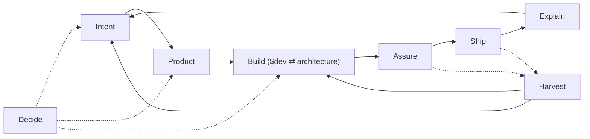

# Skills

Personal skill store for a product + engineering AI skill OS: domain routers (Build entry: `dev`), Solution craft (`architecture`), and thin language adapters/overlays under `agents/skills/`. Vocabulary: [`CONTEXT.md`](CONTEXT.md).

## Install

Global (user-level Cursor + Codex):

```sh
npx skills add gildesmarais/dotfiles/agents/skills -g -a cursor -a codex -y
```

Requires Node.js (`npx`) and GitHub access to `gildesmarais/dotfiles`. Verify with `npx skills list -g`.

| Intent               | Command                                                                       |
| -------------------- | ----------------------------------------------------------------------------- |
| Browse               | `npx skills add gildesmarais/dotfiles/agents/skills --list`                   |
| Project-level        | Same add, omit `-g`; run from the target repo                                 |
| Specific skills      | Add `--skill <name>` (repeatable), e.g. `--skill review.gil --skill docs`     |
| This machine (`rcm`) | `rcup` → `~/.agents/skills/<name>/` — [Operate the store](#operate-the-store) |

Equivalent sources: `gildesmarais/dotfiles`, the GitHub URL, or `…/tree/master/agents/skills`. CLI: [vercel-labs/skills](https://github.com/vercel-labs/skills).

## Pipeline



## Domain map

| Domain       | Job                              | Skill(s)                                                                                                                    | Primary branches                                                                                                                           |
| ------------ | -------------------------------- | --------------------------------------------------------------------------------------------------------------------------- | ------------------------------------------------------------------------------------------------------------------------------------------ |
| **Intent**   | Fuzzy need → actionable work     | `triage`; `prompt-compiler`; `jira-ticket`; `orchestrator`; `pr-sweep`                                                      | `triage`: `intake` (+ playbooks); `prompt-compiler`: `compile` \| `run`; Jira → `jira-ticket`; `orchestrator`: `run`; `pr-sweep`: `report` |
| **Product**  | What to build; admit/defer scope | `product-owner`                                                                                                             | `gate` (default); `story-slice`; stubs: prioritize, experiment                                                                             |
| **Solution** | How the system should work       | `architecture`; `docs` **`architecture`** (verify-only); `dev` **`plan`** (implementation-plan carrier)                     | craft: `deep-modules` \| `refactor-types` \| `refactor-boundaries` \| `performance`; survey: `structure-survey`; plan: `dev` **`plan`**    |
| **Build**    | Change the codebase              | `dev` (router); adapters `ruby-dev`, `rust-dev`, `swift-dev`, `typescript-dev`; overlays `ruby-on-rails-dev`, `swiftui-dev` | `plan` \| `implement`; classify: surgical \| design \| review-hand-off                                                                     |
| **Assure**   | Safe to merge?                   | `review.gil`                                                                                                                | `findings`, `publish`, `quality` (lenses: tests, perf, security, legacy)                                                                   |
| **Ship**     | Land on mainline                 | `pull-request`; `dependabot`; `release`                                                                                     | PR: open, slice, comment, reply, resolve, fix-ci, conflicts (+ unblock chain); Dependabot: configure \| triage; release: `notes`           |
| **Explain**  | Humans understand state          | `communication`; `docs`                                                                                                     | see skill branches                                                                                                                         |
| **Decide**   | Stress-test choices              | `grilling` (third-party); `product-owner` Forced Challenge                                                                  | —                                                                                                                                          |
| **Harvest**  | Continuous learning & debt loop  | `harvest`                                                                                                                   | `distill` (default); `debt`                                                                                                                |

Published Build overlays: `ruby-on-rails-dev`, `swiftui-dev`.

## Optional packs (not OS SoT)

Third-party helpers outside the domain routers. Not OS source of truth; not in the store install above.

```sh
npx skills add https://github.com/mattpocock/skills --skill grilling -g -a cursor -a codex -y && \
npx skills add https://github.com/twostraws/swiftui-agent-skill --skill swiftui-pro -g -a cursor -a codex -y && \
npx skills add https://github.com/twostraws/swift-testing-agent-skill --skill swift-testing-pro -g -a cursor -a codex -y && \
npx skills add https://github.com/arjitj2/swiftui-design-principles --skill swiftui-design-principles -g -a cursor -a codex -y
```

| Pack                        | When                           | Role                                                            |
| --------------------------- | ------------------------------ | --------------------------------------------------------------- |
| `grilling`                  | Stress-test a plan or decision | Upstream Decide skill                                           |
| `docs-sync`                 | Sync Clean Arch domain docs    | Solution/Explain documentation synchronization engine           |
| `swiftui-pro`               | SwiftUI review depth           | Compose via `$dev` + `swiftui-dev`; depth pack, not Build entry |
| `swift-testing-pro`         | Swift Testing depth            | Compose via `$dev` + `swift-dev`; depth pack, not Build entry   |
| `swiftui-design-principles` | Spacing, typography, materials | Compose via `$dev` + `swiftui-dev`; depth pack, not Build entry |

More: [skills.sh](https://skills.sh/). Swift catalog: [Swift-Agent-Skills](https://github.com/twostraws/Swift-Agent-Skills).

## Compose / handoffs

**Build path (runtime):** `$dev` ⇄ `architecture` → `review.gil` → `pull-request`. `$dev` is the only Build entry; `architecture` is shift-left craft inside Build — Solution-before-Build in the domain map is conceptual, not a second entrypoint.

One-way rules (prevent domain collisions):

1. **Product before non-trivial scope** — `jira-ticket` / feature asks load `product-owner` **`gate`**. Impl continues only on **Build Now**. Multi-slice / UX-mandated AC → **`story-slice`** then `$dev` `plan`; already-one-slice asks → `$dev` only (classifies; loads `architecture` when design). Skip for pure bug fix, refactor, infra. Stubs still unauthored: `prioritize`, `experiment`. Incident/observability/reproduce **without** Jira or IR → **`triage` first** (ledger → PO and/or `$dev` `plan` per class). Jira entry stays `jira-ticket`.
2. **Craft ≠ product** — `architecture` / `dev` / `*-dev` / `review.gil` never answer “should we build X?”
3. **Build entry is `$dev`** — classify / route / phase commits live there. `architecture` axioms ride along on every `implement` (axioms-only load; branch pick + references when `design` is earned; ambiguous classify prefers `design`); do not inline craft in `dev` or `*-dev`. Multi-load `{lang}-dev` from **touched-file** evidence when a change spans runtimes. Packs: Stop — read `$dev` Shared prep before any delta.
4. **Implementation plans → `$dev` `plan`** — when writing an implementation plan (including Cursor plan mode), invoke `$dev` branch **`plan`** and load [`dev/reference/plan-pipeline.md`](dev/reference/plan-pipeline.md). Plan mode: product stance section only — `/product-owner` explicit for admission. `jira-ticket` Planning Checkpoint emits via `$dev` **`plan`** when phases/commits matter. Both `$dev` **`plan`** and `prompt-compiler` **`compile`** enforce the same Plan Invariant Contract (explicit `target_files`, `verification_gate` exit 0, atomic phase commits, and circuit-breaker rollback on failure); the persisted IR is the structured task syntax of this contract. **`run`** hands each task to `$dev` `implement` (rule 3 intact). `orchestrator` **`run`** discovers tranches from repo roadmap docs and hands each to `$dev` `implement` (rule 3 intact); no compile/IR step — docs already exist; roadmap is the state file.
5. **Phase CC → merge → notes** — Solution/Build plan phases author Conventional Commits (validate → ≥1 CC + rationale) via `architecture` Shared prep and `$dev` — by default off the default branch; ask early when on default. After merge, `release` **`notes`** consumes history. At PR open, `pull-request` **`open`** applies the same format only if the tree is still dirty. Format SoT: [`CONTEXT.md`](CONTEXT.md).
6. **Assure → Ship** — `findings` never posts; `publish` (e2e → GitHub `COMMENT`) lives under `review.gil`; verified-ledger posting lives under `pull-request` **`comment`** — never reverse those two. After **every** Build delivery (plan-driven or surgical), emit the standardized Delivery Ledger DTO and run `review.gil` **`findings`** (security/quality when in scope) before reporting done: spawn preferred for plan-driven, multi-phase, or security-cue work; small single-surface surgical diffs may use a fresh in-session pass. Trivial diffs (docs-only, comment/typo, single-line config) may skip with the reason stated in the handoff. Orchestrated workers under `prompt-compiler` **`run`** or `orchestrator` **`run`** skip per-task Assure (DAG-level once). If user asked to land and readiness is Yes/Conditional → `pull-request` **`open`**.
7. **Explain → docs** — `communication` → `docs` **`editor`** when the artifact is a README/runbook, not a message. Never reverse. `docs` **`architecture`** is Solution-adjacent verify-only (no HLD/ADR author).
8. **Overlay via `$dev` route** — `ruby-on-rails-dev` with `ruby-dev`; `swiftui-dev` with `swift-dev` (loaded by `$dev`, not as competing Build entries). Depth packs stay on pack **Compose routes**.
9. **Decide** — `grilling` stress-tests Intent / Product / Solution; product doctrine stays with `product-owner` when the topic is scope.
10. **API-truth soft deps** — API truth assumes Dash and/or Context7; if neither is available, agents warn once on first material API fallthrough then fall back (do not invent APIs). See `$dev` / [`CONTEXT.md`](CONTEXT.md).
11. **Observability cue** — APM / error tracking / logging via matching MCP when links appear; not a vendor SoT under Build.
12. **Sweep never fixes** — `pr-sweep` emits a compact ledger only; rows route to `pull-request` / `dependabot` / `review.gil`. Never reverse.
13. **Unblock chain** — `pull-request` "unblock / make merge-ready" runs **conflicts → resolve → fix-ci** in order (live state each pass); never auto-approve/merge. Dependabot assessment stays on `dependabot` **triage** (may call **fix-ci**).
14. **Harvest loop** — `review.gil` (Assure) and `pull-request` (Ship) hand off to `harvest` whenever non-obvious fixes, user corrections, review findings, or deferred architectural debt occur. `harvest distill` writes imperative preventive mantras to local rules (`<project>/AGENTS.md`) or global store references (`architecture`, `review.gil`, `{lang}-dev`). `harvest debt` logs structural rot to `<project>/.agents/debt-ledger.md`. `product-owner` admits debt tranches under its Health Capacity Budget (~20% capacity or 1 debt tranche per 3–4 feature tranches) to feed `orchestrator` / `$dev`.

## Skill index

| Domain   | Skills                                                                                                                                                                                                    |
| -------- | --------------------------------------------------------------------------------------------------------------------------------------------------------------------------------------------------------- |
| Intent   | [`triage`](triage/), [`prompt-compiler`](prompt-compiler/), [`jira-ticket`](jira-ticket/), [`orchestrator`](orchestrator/), [`pr-sweep`](pr-sweep/)                                                       |
| Product  | [`product-owner`](product-owner/)                                                                                                                                                                         |
| Solution | [`architecture`](architecture/), [`docs`](docs/)                                                                                                                                                          |
| Build    | [`dev`](dev/), [`ruby-dev`](ruby-dev/), [`rust-dev`](rust-dev/), [`swift-dev`](swift-dev/), [`typescript-dev`](typescript-dev/), [`ruby-on-rails-dev`](ruby-on-rails-dev/), [`swiftui-dev`](swiftui-dev/) |
| Assure   | [`review.gil`](review.gil/)                                                                                                                                                                               |
| Ship     | [`pull-request`](pull-request/), [`dependabot`](dependabot/), [`release`](release/)                                                                                                                       |
| Explain  | [`communication`](communication/), [`docs`](docs/)                                                                                                                                                        |
| Decide   | `grilling` (third-party — [Optional packs](#optional-packs-not-os-sot))                                                                                                                                   |
| Harvest  | [`harvest`](harvest/)                                                                                                                                                                                     |

## Authoring laws

- **One router per domain** — branches for verb-paths; progressive load.
- **Freeze the router** — harvest via staging → sparse-promote onto `reference/<branch>.md`; edit `SKILL.md` only when the contract is wrong.
- **Compose across domains** with one-way handoffs (above).
- **Thin `*-dev`** — craft stays in `architecture`; shared classify/workflow/phase commits stay on `$dev`; overlays are deltas only.
- **Phase commits on `dev`** — Build carrier is `$dev` Shared prep (cite [`CONTEXT.md`](CONTEXT.md)); overlays never copy it. `{lang}-dev` packs add language deltas only. Solution craft phases still commit via `architecture` Shared prep.
- **Proliferation guard** — new top-level skill only if it cannot be a branch of an existing router (for refactor concerns: `refactor-<concern>` under `architecture`, never bare `refactor` or a parallel `product` skill). Runtime route table stays in frozen `dev/SKILL.md` (contract edit for new langs — not a parallel registry).
- **Zero backward compat** — clean cutovers on store refactors: delete superseded aliases, old execution names, and dual shims immediately. Backward-compatibility shims waste token context and trigger dual-ownership confusion in LLMs.
- **Agentic architecture (tokens over CPU)** — treat attention, token weight, and round-trip latency as the architectural currency. Enforce single ownership of decisions, keep routers deep via progressive disclosure, use bounded Markdown DTOs for handoffs, and avoid intermediate prompt abstraction layers or brittle nested AST schemas for conversational turns.

Router shape: `## Pick branch` → `## Shared prep` → `## Branch reference` → `## Handoff` → `## Completion criteria`. Relative `reference/*.md` links; unnumbered `##` headers. Terms: [`CONTEXT.md`](CONTEXT.md). Spec: [agentskills.io](https://agentskills.io/).

## Operate the store

Dotfiles + `rcm` on this machine. Everyone else: [Install](#install).

Git-tracked trees under `agents/skills/<name>/` are the source of truth. `rcup` installs them into `~/.agents/skills/<name>/` (file-level links). Keep `SYMLINK_DIRS` unset for `agents` / `agents/skills` so `~/.agents/skills` can hold both `rcup` links and third-party dirs from `npx skills`. After clone/pull, promote/rename, or `backfill`, run `rcup` (or wait for topgrade `RCM: rcup`).

**CONTEXT:** vocabulary SoT lives at store root [`CONTEXT.md`](CONTEXT.md). `rcup` installs it to `~/.agents/skills/CONTEXT.md` so skills’ `../CONTEXT.md` citations resolve from any workspace. Keep `README.md` in `rcrc` `EXCLUDES` (would otherwise land as `~/README.md`); do **not** exclude `CONTEXT.md`. External `npx skills` consumers may lack store-root files — when `../CONTEXT.md` is absent, follow [conventionalcommits.org](https://www.conventionalcommits.org/) v1.0.0 and the phase-commit law as stated in `$dev`.

| Command                    | Role                                                                  |
| -------------------------- | --------------------------------------------------------------------- |
| `skill list`               | List non-hidden skills in the store                                   |
| `skill doctor`             | Report `ok` / `drift` / `home-only` / `broken` for store vs install   |
| `skill backfill <name>`    | Copy drifted real files from `~/.agents/skills/<name>` into the store |
| `skill promote <name>`     | Move `<project>/.agents/skills/<name>` into the store                 |
| `skill rename <old> <new>` | Rename in the store                                                   |
| `rcup`                     | Install store skills into `~/.agents/skills`                          |

When `skill doctor` reports `drift`, run `skill backfill <name>`, then `rcup`.

| Scope         | Path                                             |
| ------------- | ------------------------------------------------ |
| Store         | `agents/skills/<name>/` in this repo             |
| Agent install | `~/.agents/skills/<name>/` via `rcup`            |
| Project draft | `<repo>/.agents/skills/<name>/` (promote source) |
