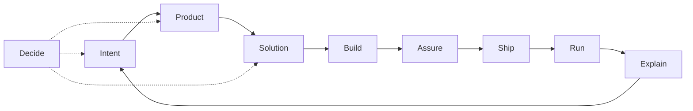

# Skills

Personal skill store for a **product + engineering AI skill OS**: domain routers plus thin language adapters. Canonical source: `~/.dotfiles/skills/`. Vocabulary lives in [`CONTEXT.md`](CONTEXT.md).

Install agents with [`npx skills`](https://github.com/vercel-labs/skills). Use `./scripts/skill` only for store hygiene (`promote`, `rename`, `list`).

## Pipeline



## Domain map

| Domain       | Job                              | Skill(s)                                                              | Primary branches                                                                | Status                                      |
| ------------ | -------------------------------- | --------------------------------------------------------------------- | ------------------------------------------------------------------------------- | ------------------------------------------- |
| **Intent**   | Fuzzy need → actionable work     | `prompt-synthesis`; `jira-ticket`                                     | (entry workflows)                                                               | active — Spec/PRD router still **gap**      |
| **Product**  | What to build; admit/defer scope | `product-owner`                                                       | `gate` (default); stubs: prioritize, story-slice, experiment                    | active gate; other Product branches **gap** |
| **Solution** | How the system should work       | `architecture`; `docs` **`architecture`** (docs only)                 | `deep-modules` \| `refactor-types` \| `performance`; stub `refactor-boundaries` | active; HLD/ADR author **gap**              |
| **Build**    | Change the codebase              | `ruby-dev`, `rust-dev`; overlays `ruby-on-rails-dev`, `mir-architect` | classify: surgical \| design \| review-hand-off                                 | active                                      |
| **Assure**   | Safe to merge?                   | `review`                                                              | finish, quality, tests, perf, security, publish                                 | active — test-design author **gap**         |
| **Ship**     | Land on mainline                 | `pull-request`                                                        | open, slice, comment, reply, resolve                                            | active — Release router **gap**             |
| **Run**      | Production health                | thin (e.g. jira → Datadog)                                            | —                                                                               | **gap** (Incident)                          |
| **Explain**  | Humans understand state          | `communication`; `docs`                                               | see skill branches                                                              | active                                      |
| **Decide**   | Stress-test choices              | `grilling` (agent-local); `product-owner` Forced Challenge            | —                                                                               | grilling not first-party store skill        |

Third-party packs under `skills/` (`ms-rust`, `rust-performance`, …) are optional spice — never OS source of truth. External registries exist; this README’s examples stay on **this** store.

## Compose / handoffs

One-way rules (prevent domain collisions):

1. **Product before non-trivial scope** — `jira-ticket` / feature asks load `product-owner` **`gate`**. Impl continues only on **Build Now**. Skip for pure bugfix, refactor, infra.
2. **Craft ≠ product** — `architecture` / `*-dev` / `review` never answer “should we build X?”
3. **Build → Solution** — `*-dev` class `design` loads `architecture` (branch pick inside); do not inline craft in `*-dev`.
4. **Assure → Ship** — `review` may hand off to `pull-request` **`comment`**. Never reverse: GitHub posting does not live under `review`.
5. **Explain → docs** — `communication` → `docs` **`editor`** when the artifact is a README/runbook, not a message. Never reverse.
6. **Overlay → runtime** — `ruby-on-rails-dev` / `mir-architect` compose with the matching `*-dev`.

## Skill index

| Domain   | Skills                                                                                                                         |
| -------- | ------------------------------------------------------------------------------------------------------------------------------ |
| Intent   | [`prompt-synthesis`](prompt-synthesis/), [`jira-ticket`](jira-ticket/)                                                         |
| Product  | [`product-owner`](product-owner/)                                                                                              |
| Solution | [`architecture`](architecture/), [`docs`](docs/)                                                                               |
| Build    | [`ruby-dev`](ruby-dev/), [`rust-dev`](rust-dev/), [`ruby-on-rails-dev`](ruby-on-rails-dev/), [`mir-architect`](mir-architect/) |
| Assure   | [`review`](review/)                                                                                                            |
| Ship     | [`pull-request`](pull-request/)                                                                                                |
| Explain  | [`communication`](communication/), [`docs`](docs/)                                                                             |

## Authoring laws

- **One router per domain** — branches for verb-paths; progressive load.
- **Freeze the router** — harvest lessons into `reference/` (tag branch); edit `SKILL.md` only when the contract is wrong.
- **Compose across domains** with one-way handoffs (above).
- **Thin `*-dev`** — craft stays in `architecture`; overlays are deltas only.
- **Proliferation guard** — new top-level skill only if it cannot be a branch of an existing router (for refactor concerns: `refactor-<concern>` under `architecture`, never bare `refactor` or a parallel `product` skill).

Router shape: `## Pick branch` → `## Shared prep` → `## Branch reference` → `## Handoff` → `## Completion criteria`. Relative `reference/*.md` links; unnumbered `##` headers. Terms: [`CONTEXT.md`](CONTEXT.md). Spec: [agentskills.io](https://agentskills.io/).

---

## Operate the store

Dotfiles-managed installs: [`skills-lock.json`](../skills-lock.json) at the repo root. Run `npx skills add` / `remove` from `~/.dotfiles` (project scope, no `-g`) so the lock updates and `.agents/skills/` is wired. `skills-lock.json` is RCM-excluded (`rcrc`) and stays only under `~/.dotfiles`.

| Command                             | Role                                                                               |
| ----------------------------------- | ---------------------------------------------------------------------------------- |
| `skills-restore`                    | `npx skills experimental_install -y`, then prune; also via `topgrade` after `rcup` |
| `skills-restore --prune-only`       | Prune only                                                                         |
| `npx skills experimental_install`   | Install from lock — **does not** remove dropped skills                             |
| `npx skills add` / `remove`         | Mutate lock + installs — **commit the lock** afterward                             |
| `skill promote` / `rename` / `list` | Store hygiene only ([`skill/AGENTS.md`](../skill/AGENTS.md))                       |

**Prune rules** (`skills-restore`):

| Location                             | Rule                                                  |
| ------------------------------------ | ----------------------------------------------------- |
| `~/.dotfiles/.agents/skills/`        | Remove anything absent from the lock (generated tree) |
| `~/.agents`, `~/.codex`, `~/.cursor` | Remove dangling symlinks only                         |

```sh
cd ~/.dotfiles && skills-restore
```

**Promote vs install:** `skill promote <name>` moves `<project>/.agents/skills/<name>` → `~/.dotfiles/skills/` (git). `npx skills add` / restore fills `~/.dotfiles/.agents/skills/` from the lock.

### Install (this store)

```sh
cd ~/.dotfiles
npx skills add gildesmarais/dotfiles --skill review -a cursor -a codex -y
npx skills add gildesmarais/dotfiles --skill architecture -a cursor -a codex -y
npx skills add . --skill product-owner -a cursor -a codex -y   # local tree when ahead of remote
skills-restore
```

Day-to-day: `npx skills list` · `find` · `update` · `remove` · `init`. Prefer project scope from `~/.dotfiles`; `-g` only outside the lock workflow. External registries exist; do not treat them as this OS’s source of truth.

### Paths

| Scope             | Path                                                            |
| ----------------- | --------------------------------------------------------------- |
| Store (git)       | `~/.dotfiles/skills/<name>/`                                    |
| Lock installs     | `~/.dotfiles/.agents/skills/<name>/`                            |
| Other project     | `<repo>/.agents/skills/<name>/`                                 |
| Global (optional) | `~/.codex/skills/`, `~/.cursor/skills/` via `npx skills add -g` |

**Deprecated:** `skill link` and per-agent project dirs (`.codex/skills/`, …). Cleanup: remove legacy links, then `cd ~/.dotfiles && skills-restore`.

### Retired

| Retired                                                                   | Successor                                  |
| ------------------------------------------------------------------------- | ------------------------------------------ |
| `refactor-type-driven`                                                    | `architecture` **`refactor-types`**        |
| gh-review-resolve, gh-address-comments                                    | `pull-request` **`resolve`** / **`reply`** |
| findings-to-gh-pr-review                                                  | `pull-request` **`comment`**               |
| pr-opener, open-pr                                                        | `pull-request` **`open`**                  |
| pr-slicer, slice-pr                                                       | `pull-request` **`slice`**                 |
| gh-pr, gh-pr-review, gh-review-specific-pr                                | `pull-request` / `review` **`publish`**    |
| finish-review, review-tests, review-perf-ruby, review-security-compliance | `review` (+ lenses)                        |
| quality-loop                                                              | `review` **`quality`**                     |
| one-on-one-raw-notes                                                      | `communication` **`one-on-one`**           |
| message-refinement-tech-orga                                              | `communication` **`slack-message`**        |
| project-update                                                            | `communication` **`project-update`**       |
| docs-editor                                                               | `docs` **`editor`**                        |
| docs-architecture                                                         | `docs` **`architecture`**                  |

Leftover dangling symlinks from the `skill link` era are removed by `skills-restore`.
