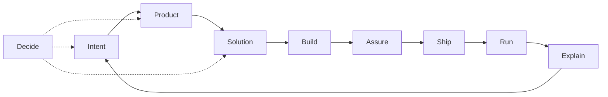

# Skills

Personal skill store for a **product + engineering AI skill OS**: domain routers plus thin language adapters. Lives at `skills/` in this repo. Vocabulary: [`CONTEXT.md`](CONTEXT.md).

Install into agents with [`npx skills`](https://github.com/vercel-labs/skills). Use `./scripts/skill` only for store hygiene (`promote`, `rename`, `list`).

## Pipeline



## Domain map

| Domain       | Job                              | Skill(s)                                                   | Primary branches                                                             | Status                                               |
| ------------ | -------------------------------- | ---------------------------------------------------------- | ---------------------------------------------------------------------------- | ---------------------------------------------------- |
| **Intent**   | Fuzzy need → actionable work     | `prompt-synthesis`; `jira-ticket`                          | `code` \| `architecture` \| `product` (default: Shared prep)                 | active — Spec/PRD **deferred**                       |
| **Product**  | What to build; admit/defer scope | `product-owner`                                            | `gate` (default); stubs: prioritize, story-slice, experiment                 | active gate; stub bodies **sequenced** (KISS)        |
| **Solution** | How the system should work       | `architecture`; `docs` **`architecture`** (verify-only)    | `deep-modules` \| `refactor-types` \| `refactor-boundaries` \| `performance` | active; HLD/ADR author **deferred**                  |
| **Build**    | Change the codebase              | `ruby-dev`, `rust-dev`; overlay `ruby-on-rails-dev`        | classify: surgical \| design \| review-hand-off                              | active — phase CC during plans                       |
| **Assure**   | Safe to merge?                   | `review`                                                   | finish, quality, tests, perf, security, publish                              | active — test-design author **gap**                  |
| **Ship**     | Land on mainline                 | `pull-request`; `release`                                  | PR: open, slice, comment, reply, resolve; release: `notes`                   | active — release ops (flag/promote/rollback) **gap** |
| **Run**      | Production health                | thin (e.g. jira → Datadog)                                 | —                                                                            | **gap** (Incident postponed)                         |
| **Explain**  | Humans understand state          | `communication`; `docs`                                    | see skill branches                                                           | active                                               |
| **Decide**   | Stress-test choices              | `grilling` (third-party); `product-owner` Forced Challenge | —                                                                            | grilling external — not first-party store skill      |

Published Build overlay: `ruby-on-rails-dev`. Local-only overlay: `mir-architect` ([below](#local-only-mir-architect)).

## Optional packs (not OS SoT)

Decide helpers and language spice sit outside the domain routers. They are never OS source of truth. From the dotfiles root (project scope, no `-g`):

```sh
cd ~/.dotfiles

# Decide
npx skills add https://github.com/mattpocock/skills --skill grilling -a cursor -a codex -y

# Rust spice (local tree under skills/)
npx skills add . --skill ms-rust -a cursor -a codex -y
npx skills add . --skill rust-performance -a cursor -a codex -y

# Swift / Apple (pick what you need)
npx skills add https://github.com/twostraws/swiftui-agent-skill --skill swiftui-pro -a cursor -a codex -y
npx skills add https://github.com/twostraws/swift-testing-agent-skill --skill swift-testing-pro -a cursor -a codex -y
# Catalog: https://github.com/twostraws/Swift-Agent-Skills
# App-repo specialists: cd <repo> && npx skills add . --skill <name> …

skills-restore   # then commit skills-lock.json if it changed
```

| Pack               | When you want it                                   | Role                                                   |
| ------------------ | -------------------------------------------------- | ------------------------------------------------------ |
| `grilling`         | Stress-test a plan or decision                     | Upstream Decide skill                                  |
| `ms-rust`          | Microsoft-style Rust guidelines before `.rs` edits | Compose with `rust-dev`                                |
| `rust-performance` | Measure-before-optimize Rust work                  | Craft ownership stays `architecture` **`performance`** |
| `swift-*`          | SwiftUI / Swift Testing / Apple packs              | Upstream or `<repo>/.agents/skills/` specialists       |

Discover more on [skills.sh](https://skills.sh/). First-party OS installs: [below](#install-this-store).

## Compose / handoffs

One-way rules (prevent domain collisions):

1. **Product before non-trivial scope** — `jira-ticket` / feature asks load `product-owner` **`gate`**. Impl continues only on **Build Now**. Skip for pure bugfix, refactor, infra. Product is gate-only this pass (stubs unauthored).
2. **Craft ≠ product** — `architecture` / `*-dev` / `review` never answer “should we build X?”
3. **Build → Solution** — `*-dev` class `design` loads `architecture` (branch pick inside); do not inline craft in `*-dev`.
4. **Phase CC → merge → notes** — Solution/Build plan phases author Conventional Commits (validate → ≥1 CC + rationale). After merge, `release` **`notes`** consumes history. `pull-request` **`open`** is leftover applicator only. Format SoT: [`CONTEXT.md`](CONTEXT.md).
5. **Assure → Ship** — `review` may hand off to `pull-request` **`comment`**. Never reverse: GitHub posting does not live under `review`.
6. **Explain → docs** — `communication` → `docs` **`editor`** when the artifact is a README/runbook, not a message. Never reverse. `docs` **`architecture`** is Solution-adjacent verify-only (no HLD/ADR author).
7. **Overlay → runtime** — Published: `ruby-on-rails-dev` with `ruby-dev`. Local-only: `mir-architect` with `rust-dev` ([below](#local-only-mir-architect)).
8. **Decide** — `grilling` stress-tests Intent / Product / Solution; product doctrine stays with `product-owner` when the topic is scope.

## Skill index

| Domain   | Skills                                                                                      |
| -------- | ------------------------------------------------------------------------------------------- |
| Intent   | [`prompt-synthesis`](prompt-synthesis/), [`jira-ticket`](jira-ticket/)                      |
| Product  | [`product-owner`](product-owner/)                                                           |
| Solution | [`architecture`](architecture/), [`docs`](docs/)                                            |
| Build    | [`ruby-dev`](ruby-dev/), [`rust-dev`](rust-dev/), [`ruby-on-rails-dev`](ruby-on-rails-dev/) |
| Assure   | [`review`](review/)                                                                         |
| Ship     | [`pull-request`](pull-request/), [`release`](release/)                                      |
| Explain  | [`communication`](communication/), [`docs`](docs/)                                          |
| Decide   | `grilling` (third-party — [Optional packs](#optional-packs-not-os-sot))                     |

### Local-only: `mir-architect`

MIR / rhythmic-analysis overlay for `rust-dev` (club music grids, downbeat, tempo).

|           |                                                                 |
| --------- | --------------------------------------------------------------- |
| **When**  | `skills/mir-architect/` is present on this machine              |
| **How**   | Wire agents from the local tree (below)                         |
| **Scope** | Local-only; not lock-managed; omit from public install examples |

```sh
cd ~/.dotfiles
npx skills add . --skill mir-architect -a cursor -a codex -y
```

Skip if you are not on that MIR stack.

## Authoring laws

- **One router per domain** — branches for verb-paths; progressive load.
- **Freeze the router** — harvest lessons into `reference/` (tag branch); edit `SKILL.md` only when the contract is wrong.
- **Compose across domains** with one-way handoffs (above).
- **Thin `*-dev`** — craft stays in `architecture`; overlays are deltas only.
- **Local-only overlays** — may live under `skills/` (e.g. `mir-architect`) without lock entries; document when/how/scope, and install with `npx skills add . --skill …`.
- **Proliferation guard** — new top-level skill only if it cannot be a branch of an existing router (for refactor concerns: `refactor-<concern>` under `architecture`, never bare `refactor` or a parallel `product` skill).

Router shape: `## Pick branch` → `## Shared prep` → `## Branch reference` → `## Handoff` → `## Completion criteria`. Relative `reference/*.md` links; unnumbered `##` headers. Terms: [`CONTEXT.md`](CONTEXT.md). Spec: [agentskills.io](https://agentskills.io/).

---

## Operate the store

Dotfiles-managed installs: [`skills-lock.json`](../skills-lock.json) at the repo root. Run `npx skills add` / `remove` from `~/.dotfiles` (project scope, no `-g`) so the lock updates and `.agents/skills/` is wired. `skills-lock.json` is RCM-excluded (`rcrc`) and stays only under `~/.dotfiles`.

| Command                             | Role                                                                               |
| ----------------------------------- | ---------------------------------------------------------------------------------- |
| `skills-restore`                    | `npx skills experimental_install -y`, then prune; also via `topgrade` after `rcup` |
| `skills-restore --prune-only`       | Prune only                                                                         |
| `npx skills experimental_install`   | Install from lock — **does not** remove dropped skills                             |
| `npx skills add` / `remove`         | Mutate lock + installs — **commit the lock** afterward                             |
| `skill promote` / `rename` / `list` | Store hygiene only ([`skill/AGENTS.md`](../skill/AGENTS.md))                       |

**Prune rules** (`skills-restore`):

| Location                             | Rule                                                  |
| ------------------------------------ | ----------------------------------------------------- |
| `~/.dotfiles/.agents/skills/`        | Remove anything absent from the lock (generated tree) |
| `~/.agents`, `~/.codex`, `~/.cursor` | Remove dangling symlinks only                         |

```sh
cd ~/.dotfiles && skills-restore
```

**Promote vs install:** `skill promote <name>` moves `<project>/.agents/skills/<name>` → `~/.dotfiles/skills/` (git). `npx skills add` / restore fills `~/.dotfiles/.agents/skills/` from the lock.

### Install (this store)

```sh
cd ~/.dotfiles
npx skills add gildesmarais/dotfiles --skill review -a cursor -a codex -y
npx skills add gildesmarais/dotfiles --skill architecture -a cursor -a codex -y
npx skills add . --skill product-owner -a cursor -a codex -y   # local tree when ahead of remote
npx skills add . --skill release -a cursor -a codex -y
skills-restore
```

Day-to-day: `npx skills list` · `find` · `update` · `remove` · `init`. Prefer project scope from `~/.dotfiles`; `-g` only outside the lock workflow. Optional packs: [above](#optional-packs-not-os-sot). Local-only overlay: [`mir-architect`](#local-only-mir-architect).

### Paths

| Scope             | Path                                                 |
| ----------------- | ---------------------------------------------------- |
| Store             | `skills/<name>/` in this repo (git when published)   |
| Lock installs     | `.agents/skills/<name>/` under this repo (from lock) |
| Other project     | `<repo>/.agents/skills/<name>/`                      |
| Global (optional) | user agent dirs via `npx skills add -g`              |

### Name lookup

If a prompt names an older skill label, route to the current skill:

| Prompt name                                                               | Current skill                              |
| ------------------------------------------------------------------------- | ------------------------------------------ |
| `refactor-type-driven`                                                    | `architecture` **`refactor-types`**        |
| gh-review-resolve, gh-address-comments                                    | `pull-request` **`resolve`** / **`reply`** |
| findings-to-gh-pr-review                                                  | `pull-request` **`comment`**               |
| pr-opener, open-pr                                                        | `pull-request` **`open`**                  |
| pr-slicer, slice-pr                                                       | `pull-request` **`slice`**                 |
| gh-pr, gh-pr-review, gh-review-specific-pr                                | `pull-request` / `review` **`publish`**    |
| finish-review, review-tests, review-perf-ruby, review-security-compliance | `review` (+ lenses)                        |
| quality-loop                                                              | `review` **`quality`**                     |
| one-on-one-raw-notes                                                      | `communication` **`one-on-one`**           |
| message-refinement-tech-orga                                              | `communication` **`slack-message`**        |
| project-update                                                            | `communication` **`project-update`**       |
| docs-editor                                                               | `docs` **`editor`**                        |
| docs-architecture                                                         | `docs` **`architecture`**                  |
